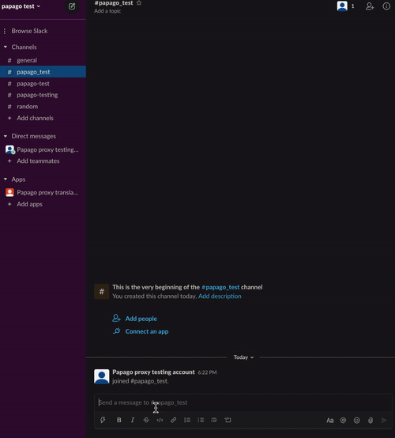
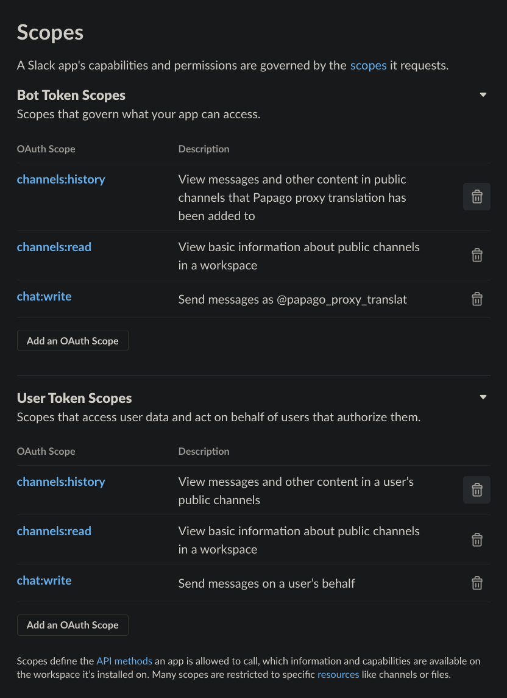

# papago-proxy-slack-app
Slack app to translate messages using [papago proxy](https://github.com/9oelM/papago-proxy) (for free!)

Since everything is free, it is not guaranteed that the Vercel serverless configuration will not hit its limit at some point. Use it with caution; but for now it works great.

## Demo

## How does everything work for free?
So I wrote [papago proxy](https://github.com/9oelM/papago-proxy) which is really just a serverless function with Puppeteer grabbing translation from Papago, on Vercel, for free.

Then I wrote this project to make it installable on Slack as an app, also hosted on Vercel for free (I'm still not sure if it is not restricted).

That's the main reason it would: 
- take almost up to 5~10 seconds to actually provide a translation because everything is free, which means it's slow. But it's good for non-immediate purpose conversation where English (or other languages supported by Papago) to Korean translation or vice versa is needed.
- sometimes not work when the serverless function not warmed up (for example, if you just got to work and just started to send the first message for today). Just try again and it might just work.

## DIY

### Deploy [papago proxy](https://github.com/9oelM/papago-proxy) first if you haven't already
1. Fork/clone this repository
2. Sign up for [vercel](https://vercel.com)
3. Add the forked/cloned repository to vercel
4. Give a shot to `your-vercel-deployment-link.vercel.app/api/translate?text=hello%20from%20papago%20proxy` to see if the deployment is successful.

### Deploy papago-proxy-slack-app

0. Fork/clone this repository
1. Sign up for [vercel](https://vercel.com)
2. Add the forked/cloned repository to vercel (make `src` the root project directory)
3. Create and add a Slack app to your workspace
4. Add appropriate scopes to the app on https://api.slack.com/apps/your-app-id/oauth:

    
5. Add event subscription to your app on https://api.slack.com/apps/your-app-id/event-subscriptions. Insert `your-vercel-deployment-link-for-papago-proxy-slack-app.vercel.app/api/event-subscription` for the Request URL Input. It should soon become verified. Subscribe to `message.channels` event too for both bot and user events:

    
6. Add your app to any channels.
7. Add `SLACK_USER_OAUTH_TOKEN` from  to your deployment of Vercel, from https://api.slack.com/apps/your-app-id/oauth.

    Add `TRANSLATE_API_URL` as `your-vercel-deployment-link-for-papago-proxy.vercel.app/api/translate` (the deployment created for [papago proxy](https://github.com/9oelM/papago-proxy))

    `LOGFLARE_*` is for logging on [Logflare](https://logflare.com). 
    
    Sign up and insert `LOGFLARE_API_KEY` and `LOGFLARE_SOURCE_TOKEN` on Vercel as needed if you want logging on Logflare too. This however is optional.

    
    
8. Use it on Slack

## What if I just wanna use the app that's published already?

This gives a higher chance that translation is sometimes not going to work because potentially lots of people might be using it. I recommend DIY. However, if your will is still to use the app that already exists on Slack, I'm planning to publish the app very soon, but I need to configure Redirect URLs and some stuffs, so I will do them later.
